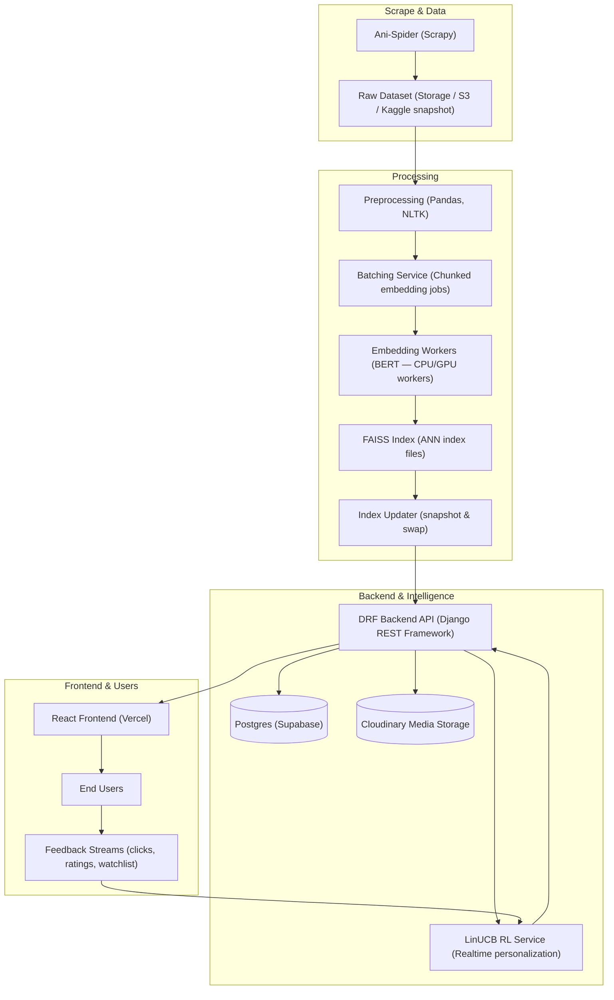

# Ani-Verse — AI‑Powered Anime Recommendation Platform 🎌

[](https://ani-verse.vercel.app)  [](LICENSE)  

**Production / Deployment repository** — this is the live, production‑ready Ani‑Verse codebase (frontend + backend + infrastructure glue). For the original development history and prototype work, see the related repositories (links below).

---

## Table of Contents

1. [Overview](#overview)
2. [Key Use Cases](#key-use-cases)
3. [Core Features (Production)](#core-features-production)
4. [High-Level Architecture](#high-level-architecture)
5. [Tech Stack (Detailed)](#tech-stack-detailed)
6. [Integrations & Remote Services](#integrations--remote-services-production-example)
7. [For Contributors — Local Dev (Minimal)](#for-contributors--local-dev-minimal)
8. [Environment Variables](#environment-variables-envexample)
9. [CI / CD, Monitoring & Observability](#ci--cd-monitoring--observability)
10. [Contributing & PR Process](#contributing--pr-process)
11. [Security & Privacy Notes](#security--privacy-notes)
12. [Related Projects & Datasets](#related-projects--datasets)
13. [License & Acknowledgments](#license--acknowledgments)

---

## Overview

Ani‑Verse is a production‑grade, full‑stack anime recommendation product that combines large‑scale scraping, NLP (BERT) embeddings, FAISS approximate nearest neighbour search, and a reinforcement‑learning personalization layer (LinUCB) to deliver fast, adaptive, and explainable anime suggestions to end users.

This repository contains the deployed code, configuration and deployment manifests that power the live site. It is optimized for reliability, observability, and operational maintenance rather than being a minimal tutorial or lightweight demo.

---

## Key Use Cases

- **Personalized discovery:** Recommend anime tailored to each user’s tastes and interaction history.  
- **Fast semantic search:** Search for titles, themes, or synopsis-based matches using BERT embeddings + FAISS.  
- **Adaptive UX:** Serve content that improves as users interact (Main recommendation loop).  
- **Content exploration:** Provide related titles, studio/genre filters and contextual recommendations.  
- **Research & datasets:** Serve as a production showcase for scalable embedding pipelines and ANN indexing (dataset published on Kaggle).

---

## Core Features (Production)

- **BERT embeddings** (CLS tokens) for every anime in the catalogue.
- **FAISS ANN index** for sub-100ms nearest neighbor retrieval at scale.
- **LinUCB (contextual multi‑armed bandit)** for live personalization and exploration/exploitation balancing.
- **User accounts & JWT auth**, secure profile features, favourites & watchlists.
- **Optimized frontend** (React + Tailwind) delivering a seamless user experience.
- **Cloud-native integrations** — Postgres on Supabase, Cloudinary for media, Vercel for frontend, Render for backend.

---

## High-Level Architecture



_The diagram above is top‑to‑bottom (TD) and highlights the full lifecycle from scraping → preprocessing → batched embedding jobs → FAISS indexing → serving & RL feedback loop._

---

## Tech Stack (Detailed)

### Frontend

- React (custom hooks, debounced search)  
- TailwindCSS, React-Icons  
- Vercel (CDN + edge caching for static assets)

### Backend & API

- Python 3.10+ with Django & Django REST Framework  
- JWT Authentication (simplejwt)

### ML & Indexing

- **BERT family model (CLS embeddings)** — used to generate embeddings for each anime.  
- **FAISS** — high-performance vector search (IVF-PQ / HNSW variants depending on scale).  
- **LinUCB** — contextual RL loop for adaptive personalization.

### Data & Storage

- PostgreSQL (Supabase) for relational user data and metadata  
- Cloudinary (media hosting) for user uploaded media
- Kaggle snapshot for dataset publication & provenance

### DevOps & Infra

- Render for backend runtime (or Kubernetes for larger deployments)  
- CI: GitHub Actions for linting, tests and artifacts  
- Secrets: environment variables + platform secrets store (Vercel / Render / Supabase secrets)

---

## Integrations & Remote Services (Production example)

- **Supabase** — PostgreSQL, Auth (optional), Storage  
- **Cloudinary** — image hosting, transformations  
- **Vercel** — frontend static hosting + edge CDN  
- **Render** — backend hosting and worker services  
- **Kaggle** — dataset publication for research reproducibility  

---

## For Contributors — Local Dev (Minimal)
>
> This repo is the **deployed** codebase. The steps below are intentionally minimal and intended for quick local PR development. **Do not** expect a 1:1 replica of production environment locally — you will need to update environment variables and service endpoints.

1. **Clone**

```bash
git clone https://github.com/YOUR_USERNAME/ani-verse.git
cd ani-verse
```

1. **Copy env template and edit**

```bash
cd backend/api
cp .env.example .env
# Edit .env to point DATABASE_URL, CLOUDINARY_URL, FAISS_INDEX_PATH, etc.
```

1. **Backend (recommended: virtualenv)**

```bash
# Considering you're already in backend folder
python -m venv .venv && source .venv/bin/activate
pip install -r requirements.txt
# If you don't have Postgres locally, use SQLITE by setting DATABASE_URL to sqlite:///db.sqlite3
python manage.py migrate
python manage.py createsuperuser  # optional but recommended
python manage.py runserver
```

1. **Frontend**

```bash
cd ../../frontend/anisite
npm install
npm run dev
```

1. **FAISS Index**

- The Dev repo already has the detailed Jupyter Notebook for creating BERT Embeddings & FAISS Index easily. Check the Notebook for [BERT Embeddings](https://github.com/manoj-323/ani-verse/blob/main/backend/embeddings/experiment/bert_practice.ipynb) and [FAISS Index](https://github.com/manoj-323/ani-verse/blob/main/backend/embeddings/experiment/faiss.ipynb) from these links directly.

---

## Environment Variables `.env.example`

Please refer to the ```.env.example``` file in the [backend/api directory](./backend/api/.env.example)

_Keep secrets out of source control. Use platform secret stores (Render/Vercel/Supabase) for production._

---

## CI / CD, Monitoring & Observability

- **CD:** Push to `main` triggers auto deployment to Render/Vercel (production). PRs open against `develop`/`staging`.

---

## Contributing & PR Process

- Fork the repo and create feature branches: `feature/<short-description>`  
- Keep PRs small and focused, include screenshots or GIFs for frontend changes.  
- Add unit tests for new backend logic and integration tests for ML pipelines when applicable.  
- Use the issue tracker: link any issue number in your PR description.  
- CI must pass before merging. Squash or rebase to keep history tidy.

Suggested labels: `enhancement`, `bug`, `discussion`, `help wanted`, `good first issue`.

---

## Security & Privacy Notes

- **User data:** only store what is necessary (profile, favourites, interactions).  
- **GDPR / privacy:** provide opt‑out for analytics & personalization.  
- **Secrets:** never commit API keys. Rotate secrets on suspected leak.  
- **Rate limits:** the public API has request throttling to protect FAISS backend.

---

## Related Projects & Datasets

### Data Assets

- **Ani-Spider (Scrapy)** — crawler project used to harvest MyAnimeList metadata and produce the raw dataset.  
[github.com/Mridul-23/Ani-Spider](https://github.com/Mridul-23/Ani-Spider)

- **Kaggle Dataset (Snapshot)** — public release of the curated dataset for reproducibility.  
  [kaggle.com/datasets/mridulnarula/anime-comprehensive-dataset](https://www.kaggle.com/datasets/mridulnarula/anime-comprehensive-dataset)

### Recommender Prototypes

- **Anirec (CLI)** — terminal-based hybrid recommender that informed Ani-Verse's ranking logic.  
  [github.com/Mridul-23/Anirec](https://github.com/Mridul-23/Anirec)

- **Anirec_w (Web)** — early SSR Django prototype demonstrating integration with Anirec.  
  [github.com/Mridul-23/Anirec_w](https://github.com/Mridul-23/Anirec_w)

### Development History

- **Dev / Collab Repo** — original collaborative development repository.  
  [github.com/manoj-323/ani-verse](https://github.com/manoj-323/ani-verse)

---

## License & Acknowledgments

This project is released under the **MIT License**. See [LICENSE](LICENSE) for details.

**Acknowledgments:** MyAnimeList (data provenance), FAISS, Hugging Face transformers/BERT, Cloudinary, Supabase, and collaborators who contributed to the early development.
